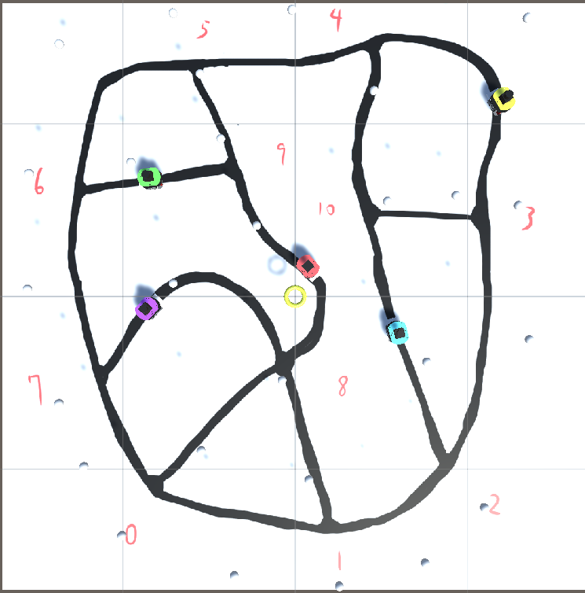

# Materials for the SoSE 2026 paper
This branch contains materials for the SoSE 2026 paper.

# Unity Simulation Environment

This simulation environment is used for the SoSE 2026 experiment.

## Simulation Environment

## Simulation Video(D-SoS)

Click the image below to watch the D-SoS simulation video.

[Download / Open the full D-SoS simulation video](https://raw.githubusercontent.com/ertlnagoya/Materials-for-Shimoyama-Thesis/blob/SoSE2026/Unity_Simulation/D-SoS.mp4)

## Simulation Video(C-SoS)

Click the image below to watch the C-SoS simulation video.

